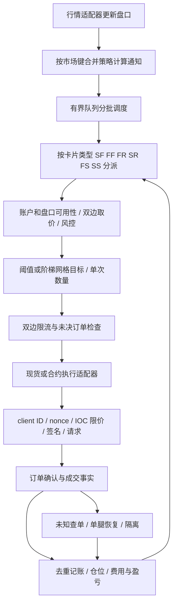

# Astro 核心行为与独立实现规格

日期：2026-10-02。模块：Astro 核心研究与自建套利设计。基线：`codex/frontend-localization-polish` / `4a4cdb7`。本文件面向实现人员，定义可模仿的产品行为和完整风险闭环，不把反编译伪代码作为运行依赖。

后续专项研究已追加：[剩余问题、分支与实施决策](astro-remaining-research-2026-10-02.md)。其中补充 E31–E59、FR价值比例规划/互斥校验、SF恢复门槛、pending异步落盘、完整新鲜度分段和发布版网格证据。涉及这些主题时以专项报告为准；旧网格文档不能视作1.9.24现行源码。

## 1. 研究结果和证据边界

在上一轮 2,867 个 bytecode arrays 解析基础上，追踪了调度器、六个策略入口、共用执行接口、SF/FR 价格公式、数量裁剪、阶梯、Hyperliquid IOC 构造到签名/HTTP 提交、订单去重与恢复。新增 30 个指令区间证据，逐条比对 1,971 条解析指令的 raw bytes 与原始文件对应位置；额外从序列化 HeapNumber 原始 8 字节恢复 12 个浮点常量。

证据文件：[指令与数值索引](research/astro-core-behavior-evidence-2026-10-02.json)。E01–E30 是该文件中的记录编号；对象地址为工具合成地址，instruction offset 为函数内字节偏移，file offset 才是样本原始偏移。样本和工具版本见 [上一轮报告](astro-decompilation-and-execution-timing-2026-10-02.md)。完整离线产物在上一轮研究目录下 `decompilation-20261002/core-chain/`，未运行目标程序。

证据等级：

- **B：字节码已核对。** 具体计算、常量、分支或调用成立；不证明生产配置及运行时表现。
- **D：官方产品契约。** SDK、STEP、GRID 文档描述；不把文档当真实执行测试。
- **S：自建明确规定。** 为获得安全、可测试的相似功能所作的实现选择，不冒充 Astro 原算法。
- **U：仍未确认。** 标注缺口，不用看似合理的伪源码补齐。

结论是可以按本规格独立实现通用套利核心，优先覆盖 SF/FF，再扩展比率/阶梯/网格。仍不声称已经恢复全部源码或所有交易所分支。高层反编译器已存在已证实的错误；未解只读对象、闭包变量的自动命名也可能误导，必须用槽位/原指令核验，不能把生成的变量名直接当业务含义。

## 2. 核心模块与调用链



以上是已观察模块关系加上自建闭环的概念图，不表示 Astro 内部每一条调用都已动态验证。关键映射：

| 角色 | 解析函数 / 对象标识 | 证据 |
| --- | --- | --- |
| 合并通知、分批消费 | rJ / `0xf000000f5900`；UI / `0xf000000f4a00` | E01–E03 |
| 策略路由 | anonymous_1422 / `0xf000007bc600` | E04 |
| SF / FF | sSe / `0xf00000741f00`；$Se / `0xf0000075a300` | 导出 calculateSF/calculateFF |
| FR / SR | XSe / `0xf00000771500`；wme / `0xf00000787000` | 导出 calculateFR/calculateSR |
| FS / SS | Vme / `0xf0000079aa00`；m0e / `0xf000007ab400` | 导出 calculateFS/calculateSS |
| 公共接口集合 | anonymous_1239 / `0xf000006ccc00` | E06 |
| 一档取价 / 数量裁剪 | Kle / `0xf000006cbe00`；Lde / `0xf000006d9600` | E07、E12 |
| 现货 / 合约分派 | Ude / `0xf000006da400`；de / `0xf000006dac00` | E06 导出链及函数分支 |
| HL 订单准备 | Aw / `0xf00000580c00` | E16 |
| HL 签名和提交 | placeOrder / `0xf00000455000` | E21、E22 |
| 成交 CAS / 恢复 | anonymous_126 / `0xf00000163500`；Uye / `0xf000007f6700` | E23、E25、E26 |

SF 的上层导入槽位已直接核对：39=getOrderBookPrice、40=properCount、41=getSpotAccount、42=getFutureAccount、43=tradeSpot、44=tradeFuture（E05）。这将上一轮 Un_1 两次匿名调用与现货/合约网关联系起来，不只是根据 BUY/SELL 字符串猜测。

## 3. 事件调度如何模仿

**B：** 队列使用 Map 保存待处理事件、数组保存键、Set 防重复排队。rJ 对已有键更新事件并计数 coalesceMerged；UI 每轮最多消费 32 个键，有剩余则 setImmediate 续跑。指标包括 backlog、processed、saturatedTicks、lastLagMs、lastDurationMs。键构造涉及 coin、fromEx、isSpot；原始字符串分隔符等只读引用未全部恢复。

**S：** 实现 `latestByKey + readyKeys + queuedKeys`。同一市场收到新状态时覆盖待评估通知，同一键最多排队一次；消费前移除 queued 标记，计算过程中到来的新事件可再次排队。每批同时设数量上限和耗时上限，避免一个重策略占满事件循环。32 可作为比较基准参数，不是普适最优值。

必须先完整应用原始盘口增量，再合并“策略需要重算”的通知；不可丢增量，更不可合并掉私有成交事件。自建键必须包括 venue、具体 DEX、原始市场、市场类型；不能仅用 ticker。批处理失败隔离对应策略，不能丢整个账户队列。

实现输出：`BookChanged(marketId, bookVersion, receivedMonoNs)` → `Evaluate(strategyId, configVersion, quoteRefs)`。记录排队耗时和计算耗时，不能把事件循环某一轮的耗时称为网络订单延迟。

## 4. 卡片配置和六类策略

**D：** Astro SDK 的 `sdk-update-pair` 提供 list/add/update/delete 卡片入口，另有消息接口；这是配置控制面，不是行情逐笔触发或双腿同步协议。文档限频为每 IP 20 次/10 秒，因此不能通过不断更新卡片实现高速执行。

**B：** 路由器按事件场所、现货/合约类型以及卡片实际市场筛选，再调用六类计算函数。配置更新 Npe 在 minNotional/maxNotional 变化时清除缓存的 minQty/maxQty 和 RA/RB 数量；可见 minNotional 的缺省回退 12、maxNotional 回退 100、leverage 回退字符串 1（E29），不等于交易所允许的最小额。

**S：** StrategyConfig 至少有：id/version、type、两腿账户与 marketId、open/close 阈值、最大持仓价值、切片 min/max notional、杠杆和保证金模式、禁开/禁平、止损、stepOpen/stepClose、执行模式、费用/资金费假设版本。更新使用版本比较，旧意图不得使用新配置悄悄发送；live 参数更改先重新验证预算。API 的修改响应不是成交确认。

| 类型 | 可模仿行为 | 验证边界 |
| --- | --- | --- |
| SF | A 现货多头与 B 合约空头，普通价差 | 已跟踪完整共享路径；现货杠杆须额外账户能力 |
| FF | A 合约多头与 B 合约空头，普通价差 | 确认同类中点分母公式；账户模式单独适配 |
| FS | A 合约与 B 现货的普通价差路线 | B 卖出现货要库存或已验证借币能力，不能凭名义对冲开空 |
| SS | 两边现货库存调换的普通价差路线 | 资金分布约束，不依赖即时转账 |
| FR | 合约之间的相对价格/比率交易 | 已确认比率公式和比较方向；不同资产不等于 delta 中性 |
| SR | 现货/另一腿组成的相对价格交易 | 官方阶梯例子为价格越低目标仓位越大；借币/报价币等另行核验 |

FR/SR 的 rateMultiply、regressionValue、positionValueRatio 不能统称一个倍率。自建分别定义显示尺度、策略数学变换和风险数量比率。Astro 对这些组合的完整变换仍 U，不提供未经验证的自动卡片转换。

## 5. 取价、阈值与数量的具体算法

### 5.1 原始 SF 行为

**B，E07/E08/E09：** 公共取价检查盘口存在、quantityReady、双边列表非空；读取选择侧 dList[0]，再从 dMap 取该价位数量。它不是多档 VWAP 计算器。SF 得到 A 买价、B 卖价、A 卖价、B 买价，计算：

`spreadOpen = 2 × (B_bid - A_ask) / (B_bid + A_ask)`

`spreadClose = 2 × (B_ask - A_bid) / (B_ask + A_bid)`

普通开仓门槛使用 `spreadOpen > openPosition`，平仓门槛使用 `spreadClose < closePosition`，是严格比较；还存在禁开/禁平、模式覆盖、确认、仓位、止损和限流门槛，不能把一个比较为真等同下单。FF/FS/SS 主函数也观察到相同中点分母计算形态。

例如 A ask=100，B bid=103，开仓价差约 2.955665%；配置 0.02 表示 2%，不是 0.02%。若等于门槛，严格比较不触发。平仓价差用反向可成交两侧重新算，不使用开仓方向报价。

**S：** 保留这个信号口径用于行为兼容，但真实订单准入必须对目标数量用多档深度、费用和滑点校验。`NetEdge(Q)` 不足时缩小 Q 或放弃。每个判定记录资金费周期/下次结算、双方成交额及币种、四侧可执行价格、费率来源、合约乘数、是否预估；任一必要条件未知则禁止新开。

### 5.2 FR/SR 比率行为

**B，E13/E14：** FR 开仓侧读取 A 买价/B 卖价，平仓侧读取 A 卖价/B 买价：`ratioOpen=A_ask/B_bid`、`ratioClose=A_bid/B_ask`；开仓比较 `< openThreshold`，平仓比较 `> closeThreshold`。SR 主函数也观察到除法形态。这里是进入计算函数后的价格，不能断言所有前置倍率未经变换。

**S：** 独立配置数学模型，明示资产、计价币和比率方向。不同资产的两腿数量由目标风险比或目标价值比确定，不采用同 base 数量假设。展示比率、真实仓位价值比、现金收益分别输出；不得称为无风险套利。

### 5.3 数量与最小下单额

**B，E11/E12：** SF 根据 stepSize、参考价、minNotional 生成 minQty，再调用 applyInstrumentMinQty；maxQty 基于 maxNotional、minQty 与参考价计算，还受 orderMaxSize 限制。properCount 对 SF/FF/FS/SS 先处理上下界，再按 minQty 的倍数取整；输入过小时局部 helper 会返回 minQty。不能把它等同于我们设计中的共同交易所最小步长，也不能脱离调用前预算直接移植。

**S：** 自建数量：

1. 把两边 lot/contract/price multiplier 转成同经济标的 base 风险单位。
2. 以有理数求两边可执行步长的共同倍数；例如 0.002 与 0.003 的共同步长为 0.006。
3. 取盘口可成交量、切片上限、账户预算、剩余目标与风险上限的最小值，再向下取共同步长。
4. 检查两边最小数量/金额；不足则跳过，不向上补量超过风险预算。
5. 现货以实际到账数量计对冲，base 收费需扣除；账户与手续费数据尚未确认时保留不确定性。

这会与 Astro 某些局部数量裁剪行为不同，是明确的安全选择。

## 6. 阶梯与网格可实现规则

**B，E10：** SF 阶梯代码计算近似持仓价值 `V=(qA×avgA+qB×avgB)/2`，容差缓冲为 `(minQty×oldPrice 或 minNotional)+3`。扫描 stepOpen 的 position/limit，选取满足价差条件的目标限额；若当前持仓价值加缓冲已达到该限额，使用 10 作为禁止继续开的门槛值。stepClose 根据持仓价值与目标 limit 选择阈值，计算需要减少的数量；代码出现 -10 哨兵。数组顺序有业务意义，不可导入后任意重排。

**D：** [STEP](https://github.com/astro-btc/Astro/blob/a21552e6802d0464824cac97e5798c9c584645da/Docs/STEP.md) 对 SF/FF 示例为价差 1%/2%/3% 对应目标 1000/2000/3000；SR 示例则价格下降时增加目标仓位。

**S：** 将每阶解释为“达到条件时的目标持仓上限/平仓后剩余目标”，不是每次额外买入该 limit。用显式 NO_OPEN/NO_CLOSE 代替 10/-10 魔法数，保存 activeStep 与 configVersion。根据目标减去已确认仓位和所有在途预留得到可新增数量；不要每次重算都再下一个完整阶梯订单。兼容显示可采用成本价值，风险准入必须同时检查当前市值。

**D：** [GRID](https://github.com/astro-btc/Astro/blob/a21552e6802d0464824cac97e5798c9c584645da/Docs/GRID.md) 定义范围 [L,U]、N 格、间距 `(U-L)/N`、每格价值 `Vmax/N`；下穿某格下沿才买，上穿其上沿才卖；初始位于第 N 格时买其上方相邻格；部分成交不改变“已完成”的满/空状态。例 L=.025、U=.0275、5 格、总价值1000，每格200；初值 .026111 对应官方第3格，先建立第2格。

**S：** 每格使用 EMPTY → BUYING → PARTIAL → FULL → SELLING → EMPTY，并独立保存累计量、成本、订单、费用；显示满/空只在目标完成时切换。每个格子最多一个执行意图；跳空跨多格逐格规划但受全账户预算和并发上限，不能同一格重复买卖。区间端点、越界、重启、参数更改必须定义；默认不在区间外新增格子。网格完成只在两腿实际匹配后确认，收益扣真实费用。GRID 的源码逐分支对应尚未完成，本段为产品契约的独立实现。

## 7. 双腿执行与 Hyperliquid 的实际路径

**B：** Un_1 的普通分支调用 tradeSpot(BUY) 与 tradeFuture(SELL)，同层没有 await 第一腿确认；abFirst 分支维护先后腿和 lastTradeCountForAbFirst。不能据此保证请求真正同时上网。

HL 链条已追至：`tradeFuture → lt/zoe → Aw → placeOrder → orderToWire → generateNonce → signL1Action → makeExchangeRequest`。其中 orderToWire 在缺显式 limit_px 且为 Ioc 时 await calculateIocLimitPrice；后者 await getAllMids。

**B，E15–E22：**

- 构造器 allMidsCacheTtlMs 默认 30000；缓存按 DEX/default 分开，未过期返回 data，已有请求返回同一个 promise，缺失/过期调用 makeInfoRequest。30 秒是此 mid 缓存默认，不是策略盘口允许陈旧 30 秒。
- Aw 的请求包含 `cid/coin/is_buy/sz/order_type.limit.tif=Ioc/reduce_only/slippage`。该请求模板 slippage 的原始 float64 为 **0.1**。
- calculateIocLimitPrice 未取整的保护价为 `mid×(1+slippage)` 或 `mid×(1-slippage)`。所以该模板的 0.1 表示 **10% 的名义价格容忍区间**，不是 0.1%；不意味着实际成交必然滑点 10%。最终价格还有有效数字/小数位处理，且显式 limit_px 可走另一分支。
- generateNonce 的局部规则为：若当前时钟值不大于 lastNonceTimestamp，使用 last+1，否则使用当前值。它保证该对象存活期间的单调性，不证明多实例或重启后不冲突。
- placeOrder 先等待 wire 构造，再生成 nonce、等待 signL1Action、提交 exchange HTTP POST。签名涉及 actionHash、phantom agent、wallet.signTypedData；实际密钥/签名内容不输出。
- Aw 调用 addOrder 早于 placeOrder，但该处未 await addOrder。不能把“先调用记账函数”当作“已可靠持久化后发单”。

**S：** 不复制 10% 宽保护作为套利默认；用净收益预算和当前可信盘口制定显式限价。缓存 miss 必须发生在双腿放行之前，任何签名/报价准备超时都使整个机会重新评估。账户级 nonce 唯一所有者，重启结合平台有效窗口和持久状态处理；原平台签名采用经核验 SDK/官方协议，不运行反编译签名代码。

两种模式的实现顺序：

```text
prepare: 固定配置版本和盘口版本 → 生成共同风险数量 → 双边检查
reserve: 事务写入两腿意图、风险预留、稳定 client IDs
ready:   预备通道/签名/nonce/限流，重验价格期限与预算
dispatch:
  顺序模式：发送 A，按确认成交增量生成 B（扣除已在途 B）
  并行模式：持久记录两腿发送尝试后连续放行 A、B，不等 A ACK
observe: 按成交事实更新；结果未知保留 UNKNOWN
finish:  两边数量匹配且无可能影响该切片的在途订单，才 HEDGED
```

准备好 A 不意味着可先发送 A 再等 B 查询 mid。两次 write 间崩溃仍存在，风险预算必须允许任一腿单独成交。性能目标分别测 SDK 调用、传输提交、ACK、首笔/最终成交和裸露敞口；无跨场所原子性保证。

## 8. 成交、去重、补腿和重启恢复

**B，E23：** casFillOrder 的 SQL 为条件更新：`UPDATE order SET status=?, price=?, coinSize=?, fee=? WHERE id=? AND status=0`，状态参数为1；返回 changes>0。重复调用只有首次可更新。该 SQL 已在一次性内存 SQLite 中验证，结果 `[1,0]`。

**B，E24：** appendOrderFill SQL 按新增量累加 coinSize/fee、按数量计算加权均价；该条 SQL 本身没有 fill ID 去重条件。不能据此声称完整调用链有重复记账漏洞，调用方可能做了去重，但自建必须在同一事务中做明确唯一性约束。

**B，E25/E26：** 恢复函数 await 查单结果后，可见调用 removePendingOrderByReqId，然后进入状态/数量解释；filled 分支 await casFillOrder，只有返回真才走仓位更新路径。另有未决结果 dropped 日志。与上一轮仅发现字符串相比，现在有了调用顺序证据；但未完成跨文件持久化与运行时验证，不能把它直接宣布为线上丢单。自建禁止在结论可靠落账前删除未决事实。

**S：** 三层状态分离：

| 层 | 状态 |
| --- | --- |
| 策略 | DISABLED / READY / ACTIVE / RECOVERING / QUARANTINED |
| 切片 | PLANNED / RESERVED / DISPATCHING / PARTIAL / HEDGED / RECOVERY / CLOSED |
| 单腿订单 | INTENT / SEND_ATTEMPTED / ACKED / PARTIAL / FILLED / CANCEL_PENDING / CANCELED / REJECTED / UNKNOWN |

规则：

1. HTTP 成功、签名完成、链上广播均不是成交；订单回报与 fill 事实分开。
2. 成交事实唯一键按平台协议确定，`(account,venue,orderScope,fillId)` 或经验证的累计量差分；重复/乱序不重复加仓。费用晚到用调整事件。
3. 事件、订单投影、仓位和预留变化在同一事务提交；不先释放预算再等待补腿。
4. 已确认净风险 D、未决买余量 Ubuy、未决卖余量 Usell，最坏区间为 `[D-Usell,D+Ubuy]`。补腿不得只看当前净额。
5. 一腿明确拒绝另一腿已成交：在预算内比较补腿与原腿退出成本；不能达成时隔离并告警。两腿都明确未成交可取消切片。
6. 一腿 UNKNOWN：先查单/补成交流，不换 ID 盲重试；撤单 ACK 不等于终态，晚到成交仍接收。超时不自动转为失败。
7. 重启先冻结新开，查 open orders、近期订单、成交、余额和仓位；旧备份不能证明某订单从未发出。

专项报告已解出 SF 恢复等待8秒/38秒、记录重试门槛2/12/100及一次强制恢复标志，仍不能泛化所有平台或把超时当明确失败。自建采用明确金额/时间/次数/滑点上限和账户预算。软件限额不能保证跳空行情中的绝对损失上限。

## 9. 新 DEX 为什么受限，如何做成可扩展

**B，E15：** HL 客户端 BO 默认 perpDexes 包含 xyz，处理额外配置时有固定候选列表 `xyz/hyna/para/mkts/io` 的筛选分支。这是此样本的一处支持范围限制，不能证明它是 Arcus 无法使用的唯一原因，更不能推断 Arcus 一定属于 HL。

**S：** 场所适配器完整契约如下；只加一个下单 URL 不算支持新 DEX。

| 接口 | 必要输出/约束 |
| --- | --- |
| discoverMarkets | venue、dex、rawSymbol、assetId、结算币、合约乘数、step/tick、min/max、交易时段、规格版本 |
| streamBook | 序列化快照/增量、checksum、源时间/本地时间、重建状态 |
| streamAccount / snapshotAccount | 余额、保证金、逐市场仓位、成交游标、费用/资金费，未知不转空 |
| prepareOrder | 规范化请求、稳定 client ID、有效期、签名和 nonce 约束；不得有隐藏自动重发 |
| submit / cancel / query | 明确已知/未知结果、平台 ID、累计成交与余量、可验证终态 |
| fetchFills / funding / fees | 补查与分页、原币费用、资金费周期、来源与预估标记 |
| capabilities | IOC/FOK、reduce-only、client ID 查询/去重域、nonce 域、私有流回补、限流维度 |

HL 新 DEX 需从协议元数据获得真实资产身份，贯通行情、订单、杠杆、余额/持仓、查单、结算；允许列表是审核后的运行配置，不硬编码在策略函数里。不同 DEX 的同 ticker 不合并。独立链/AMM 则新增广播、确认、reorg、nonce、gas 和链上失败成本，不假装是订单簿接口。

## 10. 可模仿程度与交付验收

| 核心能力 | 当前已知程度 | 实现依据 |
| --- | --- | --- |
| 行情触发和有界调度 | B，足以实现机制 | E01–E04 + 本文队列契约 |
| SF/FF 普通阈值、取价、切片 | B，主要数学和接口可核验 | E05–E12 + 独立风险门槛 |
| 双腿分派 | B，上层到公共网关已连接 | 顺序/并行明确状态机 |
| HL IOC 到签名/提交 | B，主要调用链已追踪 | E15–E22 + 官方适配器验证 |
| 成交去重与重启对账 | B，关键局部已确认 | E23–E26 + S 的事务状态机 |
| 阶梯 | B+D，核心目标仓位逻辑可实现 | 第6节，魔法数改显式状态 |
| FR/SR | B+D，价值比例/规划/尾仓及显示告警公式已有专项证据；旧UI阈值端到端映射 U | 原始参数不可未经验证直接迁移 |
| 网格 | D，旧产品行为可实现；B显示旧字段已在迁移8删除 | 不冒充当前原生网格，按独立格子状态机实现 |
| 所有 CEX/DEX 的私有协议 | U，不声称全部逆向 | 按 capability 单独接入验收 |
| 相似性能/收益 | 未测，不能从语言推断 | 同环境对照、shadow 与受控实测 |

验收向量见 [16 个参考例](research/astro-core-reference-vectors-2026-10-02.json)，覆盖严格阈值、比率方向、共同步长、余量跳过、在途风险、时钟倒退 nonce、IOC 区间、base 手续费、部分网格、32项批次、CAS 重放、加权均价和成本门槛。文件逐例标注 Astro 观察或自建约定；它们是独立合成检查，不是运行 Astro 导出的 golden outputs。

下一阶段先做不持有密钥的确定性回放和 mock 执行网关，采用上述向量及主方案故障矩阵。对照模式报告“行为相同/明确改进/尚未对齐”，不能拿不同口径的延迟证明性能相同。适配器准备阶段测试缓存命中/缺失、双边限流、签名排队，之后再测传输与成交。没有资金授权时只做回放/shadow。

本轮只交付研究证据、行为规范和验证向量。未执行原 .jsc/WASM、未取得或输出私钥、未交易、未部署或更改生产数据库。该研究模块的可实施方案已经具体化；实际实现应在新模块任务中推进，避免把研究结论误标为已上线功能。
