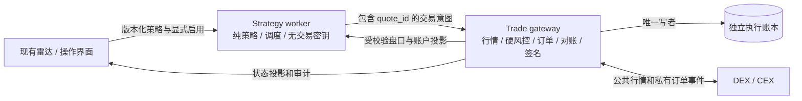

# 自建跨场所套利系统设计：效率、安全与可验证执行

日期：2026-10-02。状态：设计评审稿，非已实现系统。所属模块：自建套利执行器调研与方案。基线：`codex/frontend-localization-polish` / `b60008440918550fec930a64f5cb2a96a5cb75c8`。

后续核心调用链研究已形成 [可独立实现的行为规格](astro-core-reimplementation-spec-2026-10-02.md)，包含调度器、SF/FR 公式、阶梯、HL IOC 到签名/HTTP、成交 CAS、适配器契约，以及 30 项指令证据和 16 个离线参考向量。该文件补充本文，不改变本文的风险边界；其 B/D/S/U 标识分别区分字节码、产品文档、自建约定和未知。

## 1. 结论与第一版边界

建议建设独立于 Astro 的执行系统，沿用现有雷达作为研究和操作界面。Astro 发布包可帮助识别成熟执行器需要解决的问题，但自建系统以明确的状态机、账户事实、订单协议和故障测试为依据，不以复刻未知实现作为验收标准。

第一版只允许：一个经核验的订单簿 DEX + 一个 CEX、1–3 个同经济标的的线性现货/永续或永续/永续组合、交易专用子账户、限价 IOC、明确的持仓/敞口/亏损预算。现货卖出只使用已有库存；借币和反向现货路线另行验收。资金预先分别放置，套利闭环不依赖即时跨场所转账。

第一版暂不包含：Maker 排队策略、自动借币、提现/桥接/自动调资、不同经济资产的统计套利、反向合约、AMM/链上 swap、自动多机接管、管理 Astro 原有活跃仓位。不同报价币种如 USDT/USDC 只有明确换汇风险和估值来源后才可放行。

Arcus 仍缺用户确认的官方入口和完整市场标识，因此本文将它作为“待核验目标场所”，不假定它是 Hyperliquid、订单簿 DEX 或已支持交易 API。若实际为 AMM，必须追加链上交易生命周期设计，不能在现方案里仅替换下单 URL。

## 2. Astro 深入检查：证据和限制

样本：[Astro v1.9.24](https://github.com/astro-btc/Astro/releases/tag/v1.9.24)，ZIP SHA-256 `d28dc395203c2c6c5db1c9b9e39679c13ce942823eb3304a327ce6e770e1d3e8`；core 主字节码 SHA-256 `54339066c361389ae0a745a294a4d7641ad9945ef3d7d660e1ea17a11ec93850`。

本次固定偏移证据见 [静态证据索引](research/astro-1.9.24-static-evidence-2026-10-02.json)。偏移是原始文件字节偏移，仅证明字符串存在；字节位置相邻不证明调用关系，字符串存在不证明对应分支可达或实现正确。

| 检查发现 | 证据 | 对自建设计的影响 |
| --- | --- | --- |
| 两类持久化线索 | `pending-orders.json`、`writeFile/rename`；SQLite `order/profit` 写入 | 必须处理订单意图与成交账本跨存储失步；自建合并至一个事务性执行账本 |
| SQLite WAL 与 NORMAL | `journal_mode = WAL`、`synchronous = NORMAL` | 不能把低延迟提交等同于断电不丢失；自建订单发送前采用可靠持久化，明确存储硬件假设 |
| 恢复和去重 | `reconcilePendingOrders`、`FILLED skipped (already accounted)` | 需要独立启动对账和成交幂等，而不只读取卡片仓位 |
| CrossEx 恢复决策 | `decideGateCrossExRecovery`、`MAX_POST_CANCEL_CHECKS`、`FAIL_CLOSED`、`quarantineGateCrossExOrder` | 撤单 ACK 后还要核对终态，异常订单隔离；这些证据只覆盖相关通道，不能泛化所有交易所 |
| 结果未知保护 | `status unknown, auto retry disabled`、`retry blocked until prior order is terminal` | UNKNOWN 不能当 REJECTED；禁止盲目生成新订单 |
| 先后腿和恢复 | `abFirstShouldTradeLeft`、`recoverSingelLegTimes` | 必须显式跟踪单腿风险和有界恢复预算 |
| 保证金/行情状态 | `MMR_FORBID_OPEN`、`MMR_FORCE_REDUCE`、`BadBooksFresh` | 策略条件之外还需要账户级、行情级硬门槛 |
| 未决记录处理风险线索 | `PENDING dropped (status unresolved)`、JSON 读取失败相关日志 | 未验证控制流，不能认定 Astro 存在丢单漏洞；自建设计规定未决记录不可静默移除 |
| 比率/仓位比例互斥 | `FR positionValueRatio does not support stepOpen/stepClose!` | 价格显示倍率、回归比率、仓位比例、合约乘数必须分开建模 |

Bytenode 官方加载器会运行编译后的模块包装函数，因此 `require(.jsc)` 本身是执行程序。后续已完成主文件 2,867 个字节码数组的离线解析与线性输出，识别部分 CrossEx 恢复阈值和双腿分派；解析器匹配 V8 12.9.202.28 profile，不证明完整 Node 构建一致。高级控制流存在已核对错误，未恢复全部算法。详见 [反编译与执行时序报告](astro-decompilation-and-execution-timing-2026-10-02.md)。未执行目标程序。

进一步逆向作为有时间上限的辅助工作：先投入 1–2 工程日确认兼容运行时和安全解析工具；优先定位订单恢复与去重，不为追求全部源码无限投入。动态分析需独立、无秘密、默认断网的 Linux 沙箱；容器至少使用非 root、只读 rootfs、无宿主 Docker socket、无生产目录挂载、资源限制。mock 回报验证前不接真实交易接口。Node vm 不是系统安全边界。

官方 [STEP 文档](https://github.com/astro-btc/Astro/blob/a21552e6802d0464824cac97e5798c9c584645da/Docs/STEP.md) 的 SR 示例随价格降低增加仓位，与普通 SF/FF 阈值方向不同；[GRID 文档](https://github.com/astro-btc/Astro/blob/a21552e6802d0464824cac97e5798c9c584645da/Docs/GRID.md) 明确部分买卖尚不更新格子完成状态。它们是产品规则证据，不等于本地 FR planner 的转换已通过真实 SDK 验证。

## 3. 架构决策：两个新增进程，一个执行事实来源

保留雷达 FastAPI/React。新增 `strategy-worker` 和 `trade-gateway` 两个独立进程，部署在执行专用主机。根据后续字节码证据与双腿时序需求，新增执行系统首选从 Python asyncio 调整为 TypeScript + 经适配器验证的受支持 Node LTS；原因是 SDK 生态、异步通道和类型契约，不是断言 Python 性能不足。热点使用固定尺度整数/BigInt 或经验证 decimal 库、缓存和受控 worker，测量后再考虑 Rust/Go。试点无需 Kafka、Kubernetes 或多节点选主。

网关是受约束的交易通道，不是接受任意字节的签名机。它掌握账户真实状态、当前可信行情、余额预留、nonce、订单回报和执行账本。策略进程只能提出类型化意图，不能选择任意 URL、任意签名内容或提高网关硬额度。网关独立判断是否可发送。

网关独占账本写权限，策略通过只读投影消费状态；避免两个进程各自维护“真正持仓”。市场数据重放记录单独存文件，与资金账本分离。网关内部将行情维护、订单演员、数据库写入放在清晰模块边界；重计算或第三方阻塞 SDK 放在受限 worker，不堵塞订单事件循环。

Linux 同机使用 Unix socket + 文件权限和 peer credentials；跨机才使用 mTLS。公网 UI 无权直接访问交易网关。研究雷达被入侵后的损失上界仍由独立网关策略、账户额度和平台权限约束，但宿主 root 被攻破不能靠同机进程隔离解决。

### 3.1 模块与接口契约

| 模块 | 输入/输出 | 强制规则 |
| --- | --- | --- |
| Instrument registry | 官方市场规格 → 不可变 instrument 版本 | 保留 venue、channel、account scope、DEX、raw symbol、asset ID、结算币和合约乘数 |
| Market adapter | 快照/增量 → `BookSnapshot` | 序列/checksum 校验、时效、断线重建；不把 mark/last 当可成交价 |
| Account adapter | 余额、持仓、订单、成交、资金费 | 分页、游标重叠补查、去重、source/received 时间；清楚区分未知与空集合 |
| Execution adapter | typed place/cancel/query → 明确状态 | 缺失字段不填成成功；HTTP 200 或链上广播不等于成交 |
| Risk gateway | intent + 当前状态 → reserve/reject | 统一风险数量、最坏在途风险、费用、保证金、滑点和限额 |
| Order coordinator | 单腿事件 → 两腿状态 | 对 account/instrument 串行化变更，慢网络请求不占全局锁 |
| Ledger/reconciler | 确认事实 → 持仓与现金流 | 事件和投影在同一事务更新；崩溃恢复后先对账 |

Adapter capability 明确声明：支持的 IOC/FOK/post-only/reduce-only、client ID 长度与唯一性/查询语义、单/双向持仓、查单最终一致性窗口、用户流回补、nonce 域、费率来源及精度。`supports_client_id=true` 不等于下单天然幂等；必须测试重复 ID 在每个场所的效果。

## 4. 市场身份、数量与策略数学

### 4.1 身份和单位

唯一 instrument key 至少包括 `(venue, execution_channel, market_type, dex, raw_symbol, settlement_asset)`，账户由独立 account ID 绑定。HL 还需校验实际 asset ID 和 DEX；CrossEx 的行情来源和实际执行通道分别保存。

使用统一 base 风险单位 Q，但保留原始数量单位和价格尺度。合约 `1 lot = c base`，lot 数量步长 `s`，则 base 步长为 `c*s`；两腿共同步长用有理数缩放后的最小公倍数求解。不同 step 不能简单用较大的那个。数量向下取可实现共同数量，最后再检查两边最小金额、价格精度和剩余余额。

价格限界取整不得扩大风险：保护买单的最大限价向下取 tick，保护卖单的最低限价向上取 tick；不满足可成交性时拒绝或重新评估。无足够精度容纳共同数量时拒绝组合，不隐藏 dust。

所有配置金额用 decimal 字符串；计算用 Decimal 或按元数据固定尺度的整数。仅展示层可以 float。不要从 `regressionValue/rateMultiply` 自动推导合约规格。

### 4.2 统一收益口径

每次决策保存双方 24h 成交额（币种/换汇来源/时间）、目标 Q 的四侧深度（买A卖B开仓、卖A买B平仓）、各腿 maker/taker 费率、费率来源、资金费周期/下次结算、市场乘数和是否预估。

缺一侧成交额或账户费率等必需输入时，候选可留在研究界面，但第一版不放行新开仓。未验证资金费条件的策略不能靠“预计正资金费”覆盖成本；对未知成本使用经批准的保守上界，否则禁开。

用于显示的普通价差统一为 `2*(B_bid_vwap-A_ask_vwap)/(B_bid_vwap+A_ask_vwap)`。执行准入以计价币现金收益为主，避免不同百分比分母混用。仓库现有盘口验证器使用买价分母，浮窗使用双边中点分母；不能未经转换直接比较阈值。

对于同标的线性合约、匹配 Q、同一已确认计价单位：

`price_pnl = Q * [(A_exit - A_entry) + (B_entry - B_exit)]`

`net_pnl = price_pnl - 四笔手续费 + 实际资金费净现金流 - 借币 - Gas - 其他成本`

开仓时未来退出价差仍未知，必须明确 `expected_exit_gap` 假设、持有时间上限与压力情景；不能把“开仓卖高买低”当成已锁定利润。VWAP 已含当前盘口冲击，不再重复扣同一滑点；另加延迟与市场变化预算。报价币/费用币折算也需保存来源，不能默认稳定币恒为 1。

资金费按各场所真实结算事件、持仓时点和平台费率符号计算。每小时标准化值用于研究筛选，不替代离散现金流；补历史数据保留已结算/预测的类型，结算记录有唯一 ID，缺费率不静默填零。

### 4.3 合成算例与适用限制

算例不是 Arcus 实际行情。Q=10，买 A=100，卖 B=101；退出卖 A=100.4、买 B=100.5。四笔费率均假设 0.05%，资金费合计支出假设 0.6：价差收益 9，手续费 2.0095，净值 6.3905。仅适用于上述线性、同币种、已执行价格假设。

同样 A=100、B=101，各下 1000 计价币会买到 10、卖出约 9.90099，残留约 0.09901 base 风险。必须先匹配 Q，再检查双方名义金额。

## 5. 状态机和不可破坏的规则

### 5.1 分开三类状态

- 策略：`DRAFT → PAPER → SHADOW → ARMED`，以及 `PAUSED_NEW / REDUCE_ONLY / HALTED`。暂停新增不停止账户监控和已授权的风险处理。
- 交易：`PREPARED → OPENING → HEDGED → CLOSING → CLOSED`；异常为 `RECOVERING / NEEDS_RECONCILIATION / UNRESOLVED`。未知订单不允许标成 CLOSED。
- 订单事实：`INTENT_DURABLE / SEND_ATTEMPTED / ACKNOWLEDGED / PARTIAL / TERMINAL`。发送不确定性、撤单进度和最终剩余量分别记录；HTTP 超时设置 uncertainty，不当作零成交拒单。

不靠一个按大小排列的状态枚举处理所有事件。撤单确认后仍可能收到先前发生的成交；接受晚到成交并对账，不能因 UI 已显示 canceled 而忽略。只有经过场所协议确认的终态和最终成交量，才能释放剩余风险预留。

### 5.2 八条硬约束

1. **先持久化，再外发。** Intent、账户预算预留、策略版本、市场版本、client ID、发送 outbox 必须先在一个事务提交。
2. **不承诺网络恰好一次。** 本地 ID 和账本去重只保证本地幂等；跨场所通过 client ID、查单、成交补查恢复“发生了什么”。
3. **未知即保留风险。** 超时、缺失回报、暂时 not-found 不释放额度，不生成新 ID 重新开风险。
4. **所有在途订单计入风险。** 未成交余量、撤单中的余量和不确定结果都不能忽略。
5. **风险按账户聚合。** 多策略共享余额必须原子预留；第一版一个 instrument 只给一个策略所有权，禁止与 Astro/手工交易混用同一试点风险仓位。
6. **未知先对账。** 重启、游标缺口、账户变更、元数据变化必须核对，完成前禁开；不是读到旧快照即可继续。
7. **异常不自动抹平。** 账本损坏、无法识别的订单、缺凭据都保留可审计记录并隔离，禁止删除文件“重新开始”。
8. **资金事实优先。** 卡片值、UI 估算、策略预期不能覆盖交易所订单/成交事实；账户汇总仓位不用于凭空分配逐策略成交。

### 5.3 发送与崩溃边界

| 崩溃/故障点 | 恢复动作 |
| --- | --- |
| Intent 事务提交前 | 没有发送权限，无订单可外发 |
| 已提交但 dispatcher 尚未登记发送尝试 | 对仍为可发送状态的 intent 重新验证时效与风控；失效则撤销本地意图和预算 |
| 已登记 SEND_ATTEMPTED、发送前/中或 ACK 落盘前 | 视为不确定；先查 client ID、补查成交与未完成订单，不推断请求未到达 |
| 成交收到但投影提交前 | 重放私有流或 REST 补查，以订单累计量/成交 ID 幂等记账 |
| 撤单已请求、未确认终态 | 保留剩余在途风险，继续有界查单；不立即补发替代订单 |
| 账本不可写/磁盘满 | 拒绝新订单和签名；保持查询，尽力撤销已知订单，失败升级人工；不承诺此时可无风险自动平仓 |

对于场所无法按 client ID 或其他可靠关联查清订单的情况，第一版不启用自动实盘。只有平台协议证实相同 client ID 重发幂等时，才能重发同一请求；仍需处理平台的唯一性有效期和历史订单查询范围。

## 6. 双腿执行和敞口控制

第一版生产默认“小切片 + 先一腿 IOC、按已确认成交量对冲另一腿”。同时设计受保护并行 IOC：通过额外故障验收后，两腿意图、风险预留与发送尝试先同事务可靠提交，再连续放行，不等待 A ACK 才发 B。并行准入须覆盖任一腿独自成交的最坏风险，并核验通道、限流和 nonce；进程仍可能在两次发单之间崩溃。详见 [执行时序方案](astro-decompilation-and-execution-timing-2026-10-02.md)。优先腿根据实测流动性/拒单率/盘口寿命选择，不能硬编码总是 CEX 或总是 DEX。IOC 也可能部分成交或回报延迟，没有原子双腿保证。

正常路径：确认双边余额/深度/平仓能力 → 原子预留整个切片最坏风险 → A 成交事件 → 对已经确认且尚未对冲的增量生成 B 意图 → B 累计确认 → 数量匹配且无影响该切片的未决订单才标 HEDGED。不必等整个 A 订单结束才对冲，但同一风险键只允许一个协调器生成补腿意图，且须扣除 B 所有已提交/预留余量。

设已确认净 base 风险为 D；所有可能增加风险的在途买单余量合计 U_buy，所有可能减少风险的在途卖单余量 U_sell，则线性场景的最终风险区间为：

`[D - U_sell, D + U_buy]`

示例：已买 0.6、已卖 0.4，A 还可能成交 0.4，B 还可能成交 0.2，区间为 `[0, 0.6]`，不是确定的净多 0.2。若只按 0.2 再卖，可能出现反向风险。第一版不做未知订单的猜测式补腿；先查明/撤清，或进入预定义应急流程。

风控对最坏区间端点（并计入价格压力）施加下单准入上限。最大已知裸露、最大可能裸露、持续时间、gross notional、保证金占用分别计量；净 delta 接近零仍可能有巨额保证金和清算风险。

一腿确定失败时，比较“继续补腿”与“平掉已成交腿”的即时可执行成本，选择在预算内能降低风险的动作。预算包括金额、时间、次数、滑点和账户保证金；经济预算用于决策，最坏市场跳变仍可能造成超过预算的实际损失，不能把软件限额宣称为绝对止损保证。

持续未知时停止新开、保留订单与余额预留、提高告警级别。reduce-only 只限制某个场所持仓，不自动证明整个组合更安全；应急减仓也需判断其他腿/在途订单的最坏风险，做不到时要求人工接管。第一版应急权限只在启用策略时预先授予明确范围，无默认无限追价。

## 7. 账本、对账和存储

网关持有独立 `execution.db`。试点使用 SQLite WAL、单写者、`synchronous=FULL`，持久卷与可观测 fsync 延迟；这在正确存储栈上提高提交耐久性，不抵御硬盘虚假 flush、主机永久丢失。不要与雷达 `radar.db` 或市场回放文件共用写锁。规模增大并有真实需求时迁移 PostgreSQL，不以更换数据库代替状态机。

| 记录 | 必要字段/约束 |
| --- | --- |
| strategies / policies | 版本、内容哈希、账户、市场白名单、硬额度、模式、启用审计 |
| trade_intents / legs | intent ID、strategy version、risk key、base Q、方向、quote reference、截止时间、预留余额 |
| orders / dispatch_outbox | account + client ID 唯一、venue order ID、父意图、发送状态、累计数量、剩余量、uncertainty、epoch |
| fills | account + venue + 交易场所定义范围内的 trade ID 唯一；无可靠 ID 时使用经验证的订单累计量协议 |
| ledger_entries | fee/funding/price/borrow/adjustment，原币金额、折算来源、关联订单/结算 ID |
| account_state / reservations | 实际余额/仓位时间、保守可用额度、挂起风险、所有权 |
| events / cursors | schema version、发生/接收/单调时钟时间、来源事件 ID、追踪 ID、原始证据摘要 |
| reconciliations / quarantine | 期望与实际差异、原因、关联证据、处理决定及人员 |

订单累计成交更新、成交事实、费用和投影在同一事务内提交。WS 成交明细与 REST 累计成交不能两次入账；缺成交明细时维护 provisional projection，后续用真实 fills 替换依据而非再加一次。手续费晚到、平台更正/bust 以调整事件记录，禁止静默篡改历史。

重连/启动：先拿账户锁和网关 epoch → 暂停新开 → 补查 open orders + 最近订单/成交（分页和游标重叠窗口）→ 核对每个 UNKNOWN → 对账余额/仓位 → 恢复已授权风险处理 → 满足全部条件后恢复 ARMED。只查 open orders 会漏掉已经成交的订单，不能作为完整恢复。

启动不自动接管未知来源仓位，先隔离关联账户/市场；对手续费币、dust、资金费等差异设置明确精度规则，不通过大容差掩盖问题。备份恢复后也必须重新对账，旧备份的订单 ID 不能作为“从未发生”的证据。

单机网关使用 OS 独占锁+持久化 epoch 拒绝过期策略请求；时间租约不能拦住已经失联但仍能联网的旧进程，因此第一版不自动异机接管。重启/迁移必须确认旧发送通道停止。网关限制同一 API key/agent 的 nonce 分配唯一所有者。

## 8. 效率设计与性能目标

### 8.1 减少不必要工作

- 雷达负责全市场低频发现，执行网关仅订阅 1–3 个目标组合；公共和私有 WebSocket 长连接复用，REST 用于初始化、补查和校验。
- 元数据、精度、费用和策略版本缓存，设 TTL 与变更失效规则；不是每次报价都 fetch markets/account。
- 每个原始行情增量必须按序应用，缺口触发重建；只有在生成一致盘口快照后才能合并“待评估策略通知”。不可为了性能丢弃原始增量或私有成交事件。
- 有界队列与背压：行情滞后禁开并重建，成交队列拥塞优先补查与停止新增；风险动作高于新开，历史回放/报表最低优先级。
- 余额/订单请求有独立 rate budget，为查单/撤单留保留额度；达到限流不靠无上限重试解决。退避带抖动且有截止时间，重试是否允许依订单语义决定。
- 数据库使用专用写线程/队列，短事务；不把 REST 网络调用放在事务或全局锁内。必要时把同一次双腿预算/意图合成一次可靠提交，绝不先发订单再异步落盘。
- 低优先级指标/盘口回放可批量落盘；执行事件不可静默丢失。回放磁盘满只停止录制并告警，资金账本有独立保留空间。

### 8.2 待测 SLO，不是假定已达标

| 指标 | 首轮目标/规则 | 验证方式 |
| --- | --- | --- |
| quote snapshot → 策略决策 | p99 ≤ 5 ms | 固定硬件、记录负载与 GC/事件循环延迟 |
| 执行账本 durable commit | p99 ≤ 10 ms | 实际持久卷 fsync 压测，不能用内存盘冒充 |
| 策略 IPC + 网关风控/签名开销 | p99 ≤ 10 ms | 含独立进程往返；慢 WASM/SDK 单独计量 |
| 本地总决策到可发送 | 初始预算约 25 ms | 阶段预算相加只是规划；直接测端到端 p99，不能相加分位数宣称结果 |
| 外部请求 ACK/成交 | 按平台实测，不预设统一毫秒值 | 分 REST/WS、正常/拥塞、场所记录 p50/p95/p99 |
| 并行模式本地发单差 | 待测 p99 ≤ 5 ms | 区分 SDK 调用与传输提交；非到达或成交保证 |
| 行情新鲜度与跨腿时间差 | 初始 shadow 示例 500 ms / 200 ms | 待机会寿命与网络实测校准；不是任何场所都安全的阈值 |
| 失联后禁开 | 最迟在下一次发单前重验时效 | 活跃订单风险处理继续，不能只等 UI 变红 |

用单调时钟算本地耗时，用校时 UTC 标识事件；不信任未来时间戳，也不把两场所时钟差当成真实行情先后。原始源时间缺失或心跳不能证明盘口新鲜时标记 degraded。

基准场景建议：2 个场所、3 个组合、1000 条行情事件/秒连续 10 分钟、10000 条/秒突发 60 秒，加 100 条私有订单事件/秒的合成压测；这是验收负载建议，不是已完成压测或 Arcus 的真实速率。记录 CPU/RSS/队列长度/订单事件延迟。优先确保有界降级，目标机可暂按 2–4 vCPU、4–8 GiB 预算，最终看测量结果。

## 9. 安全设计与运维边界

### 9.1 密钥和操作权限

- API key/agent key 只存在网关专用密钥存储/内存，前端、策略、日志、回放、异常栈不接收明文。密钥加密主密钥不与密文数据库一起备份；同主机加密不能防宿主失陷。
- 平台侧使用交易专用子账户、IP 白名单和最小权限，禁提现；能限定 agent 权限时限制到交易范围。单独测试轮换和撤销，不沿用用户主钱包完整权限。
- 网关只接受白名单 instrument/account、明确价格/数量/时间界限和授权策略版本，独立检查单笔、累计、gross、敞口和风险预算。绝不暴露任意 signer、任意 URL、任意链交易 calldata 接口。
- 生产执行配置缺认证/密钥/费率/能力验证时启动即拒绝实盘。现有 radar 可选仪表盘密码模式不继承为交易认证。
- 操作角色至少 viewer/operator/admin；人工 ARMED、提高硬限额、更换账户要求强认证/近期重新认证并审计。UI 使用安全会话与 CSRF 防护（使用 cookie 时），不能仅隐藏按钮。
- 允许用户紧急暂停新开；单独区分“撤已知挂单”和“按预授权预算退出仓位”。一键关闭进程不是安全平仓。

启用实盘前下列风险策略字段必须显式填写并持久化；缺值没有宽松默认，默认模式为 paper：

| 配置 | 单位/含义 |
| --- | --- |
| `max_slice_notional / max_gross_notional` | 指定估值币；单切片与账户/策略总名义额分开 |
| `max_unhedged_base / max_unhedged_notional` | 同时约束 base 数量与压力价格下价值 |
| `max_pending_orders / max_unknown_duration` | 包含撤单中/UNKNOWN；超时触发升级不意味着自动放弃订单 |
| `max_slippage_bps / recovery_slippage_bps` | 正常与恢复分别约束，恢复额度需预授权 |
| `min_margin_buffer / max_venue_allocation` | 按场所保证金模型和分配资金限制 |
| `max_daily_turnover / max_daily_loss` | 防止反复小单磨损；损失含费用、资金费及可执行估值下的未实现变化 |
| `max_quote_age / max_pair_skew / max_account_age` | 单位 ms；按实测机会寿命与平台特性设置 |
| `max_holding_time / max_recovery_attempts` | 到期走明确退出/人工流程，不隐含保证一定能成交 |

日累计额度使用明确的 UTC 日界或约定交易日，写入账本并跨重启延续，不能通过重启或更改本地时区清零。停机、增加额度、轮换密钥有独立管理员通道，不依赖策略进程健康。限额数值要根据用户试点资金和退出成本确定，本文没有替用户授权资金规模。

### 9.2 供应链和故障域

研究 Astro 包是离线参考，不成为生产执行依赖。官方 API/SDK 锁定版本和哈希，依赖升级做契约回归；Docker 使用 digest，不使用浮动 latest 自动更新。TLS 正常校验证书，禁止照搬旧 Astro 连接的 `verify_tls=false`。

自建首版所有真实交易外联由网关发起，场所地址来自受控适配器注册表。策略/前端不能任意指定网络目标。日志脱敏并限制敏感响应保存；异常证据如必须保存放受控短期存储。

部署与雷达隔离，策略工作进程重启不丢失网关账本。网关计划发布时先禁开、完成/对账在途订单、保持明确信息；紧急故障允许进入需要人工处理状态。遵循项目生产外构建和备份验证流程，不在 2 GiB 雷达主机上运行分析包或实时交易实验。

备份使用一致性 SQLite backup API/等效工具、完整性和哈希检查、异机加密副本、恢复演练。定义 RPO/RTO 目标时将交易所补查窗口纳入；本地备份不提供主机丢失保护，也不代表恢复后可以不对账。

平台暂停、强平、ADL、稳定币脱锚、DEX sequencer/预言机故障、CEX 冻结属于剩余风险。系统通过限制参与资金、预警、退出和所有权控制降低损失，不承诺消除。

## 10. 验收矩阵：先证明失败时不会乱交易

| 场景 | 预期行为/通过条件 |
| --- | --- |
| HTTP 超时但场所已接受 | 同一 intent 进入 UNKNOWN，client ID 查单；无新 ID 盲目补发 |
| 一腿成交 60%，另一腿 0 | 正确计量已知与潜在风险，预算内补腿或退出；异常状态可见 |
| 先撤单 ACK、后到成交 | 成交正常记账，不因 canceled 丢弃；预留释放后发现差异立即再对账 |
| WS 成交重复、乱序、REST 累计重复 | 成交/现金流不重复记账，合法晚到数据仍能修正投影 |
| 首次查单 not-found、随后查到 | 不把短暂缺失当未发送，按场所最终一致性规则处理 |
| Intent 提交/发送/ACK/成交各边界崩溃 | 重启能恢复相关订单，无静默丢失；无法确认就禁开 |
| JSON/数据库损坏、磁盘满 | 保护账本证据、拒绝新开，不清空后自动恢复实盘 |
| 行情序列缺口、旧快照、时钟跳变 | 重建且禁开，不以旧盘口触发新风险 |
| 私有流断开但公共行情正常 | 账户事实失去可信度时禁开；补查回填完成才恢复 |
| 429/5xx/长尾延迟 | 有界退避、保留查单撤单预算，未知状态不盲重试 |
| 两个策略进程/旧 epoch | 网关拒绝过期和冲突请求；账户预留不超额 |
| nonce 冲突或签名服务不可用 | 不重用已广播 nonce，不绕过授权/签名检查 |
| 手工订单/未知持仓出现 | 识别所有权冲突，隔离账户或风险键，不擅自接管 |
| 合约乘数/最小金额/市场状态变化 | registry 版本失效，相关意图重验；禁止 ticker 误配 |
| 不同资金费周期、费用晚到 | 按结算事件记账，预测与实际分开，费用调整可追踪 |
| 越权策略、重放命令、任意签名请求 | 无交易产生，审计拒绝原因，限额提升必须独立授权 |

性质验证：预算预留不得为负、没有未决订单/残余仓位时才能 CLOSED、同一成交不重复改变现金流、任何出站订单均可追溯到已提交 intent 和批准的策略版本。用随机事件序列和故障注入验证，而不只测试顺利开平一单。

测试层次：纯状态机/数学 → adapter 合约与录制回放 → mock 场所故障 → testnet（如有）→ shadow ≥7天且覆盖资金费/重连事件 → 显式启用有限金额实盘。测试网不能代表生产深度/延迟；天数不能替代场景覆盖。

实盘通过条件：全流程可查、金额/数量精度内与场所对账；没有未解释的 UNKNOWN、重复风险订单或资金差异；限额、暂停和恢复实际演练通过。盈利性单独评估，不拿“成交成功”证明策略收益。

## 11. 现有代码复用决定与交付顺序

| 代码入口 | 决定 |
| --- | --- |
| `services/squeeze_arbitrage/route_engine.py` | 优先借鉴 Decimal、asset_id、contract_base_qty、共同步长和四侧 VWAP；其现有适用范围须保持可见 |
| `services/squeeze_arbitrage/paper_engine.py` | 复用模拟样本与失败场景；recovering 主要平掉已成交仓位，不是可直接上线的补腿执行器 |
| `services/orderbook_validator.py` | 保留告警前验证用途；当前顺序 REST、相同 quote notional、浮点和价差分母不能直接成为交易准入 |
| `models/orderbook.py` | 新执行模型需新增 sequence/checksum、双时间戳/单调接收时间、市场版本和整数单位 |
| `services/account_connections.py` | 复用只读账户 UI/脱敏经验，不把现有读权限凭据自动升级为交易权限 |
| `services/astro_client.py` / planner | 继续作为 Astro 控制面；自建实盘逻辑不依赖 Astro 建卡 |

实施任务按模块拆分：

1. **P0 Arcus 协议核验**：官方入口、市场身份、私有事件/查单、签名和账户能力矩阵。资料完整时约 2–4 工程日；不满足恢复能力则不进入实盘阶段。
2. **P1 执行事实与风控骨架**：独立 gateway、账本、状态机、权限和 mock adapter，先把故障矩阵跑通，约 5–10 工程日。
3. **P2 目标两场所适配/行情回放**：公开流、账户流、费用、nonce、价格数量验证，约 5–10 工程日。
4. **P3 Shadow 与有限实盘**：至少 7 天 shadow 与覆盖事件；有限实盘功能和操作验证约 5–10 工程日，观测期另计。
5. **P4 稳定化**：性能与资源测量、密钥轮换、恢复/部署手册、账本对账，约 3–7 工程日。

估计共约 20–41 工程日，1 人约 4–9 周，不把新增安全边界当成零成本，未知协议/跨链/权限等待另计。早期交付是可模拟、可验证的执行核心，不是一次性支持所有交易所。

## 12. 本次验证与尚未完成的事项

已完成：固定 v1.9.24 核心的进一步静态证据提取（19 项公开偏移索引）、关键区域交叉阅读、Bytenode 加载器行为阅读、官方 STEP/GRID 规则核对、现有执行相关代码复用审查、资金计算与未知敞口合成反例核算。

算术核算通过：上文 6.3905 合成净收益、两边等名义金额的 0.09901 残余、未知订单风险区间 `[0,0.6]`、中点分母与买价分母的差异。它们验证的是设计例子的数学，不是已实现网关的正确性或性能。

未完成且不声称完成：Astro 完整控制流反编译、匹配 V8 运行时执行、沙箱动态回放、Arcus 身份和真实接口、网关实现、故障测试矩阵执行、性能压测、真实交易和收益验证。当前 SLO、方案表和工期全部为设计目标/估算。

本轮仅交付文档与静态证据 JSON；没有更改应用、安装 Astro 或部署生产服务，不需要为文档重启容器/备份业务数据库。后续真实实现仍按项目 Git、备份、镜像、部署及线上验收规则执行。
