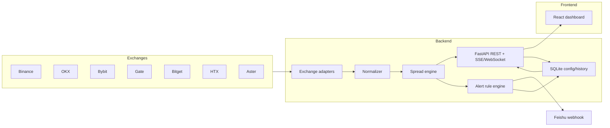

# CEX Arbitrage Radar Design

Date: 2026-05-15
Status: Design direction approved; awaiting written spec review
Scope: CEX-only monitoring and alerting, no auto-trading

## Goal

Build a self-hosted CEX arbitrage radar inspired by Pulse Lite, optimized for practical monitoring on an overseas Linux server. The system will collect public market data directly from exchanges, compute spot/future and cross-exchange spreads, display ranked opportunities in a browser dashboard, and send Feishu alerts when configured conditions are repeatedly met.

The first version is a monitoring and alerting product. It will not connect private exchange API keys, place orders, transfer assets, or manage positions.

## Non-Goals

- No automatic trading or order placement.
- No private API key storage.
- No custody, wallet, transfer, or withdrawal workflow.
- No guaranteed profit calculation; all opportunities are signals requiring manual validation.
- No TraFi or Hong Kong stock module in v1. The architecture should leave room for this later.
- No long-term historical backtesting database in v1. Short in-memory history is enough for trend display and consecutive-hit detection.

## Users And Workflows

Primary user: a trader/operator watching cross-exchange CEX arbitrage candidates.

Core workflows:

1. Open the dashboard and view ranked `SF`, `FF`, and `SS` opportunities.
2. Filter by exchange, coin, minimum 24h turnover, minimum spread, risk labels, and favorites.
3. Expand a row to inspect bid/ask, funding rate, mark/index deviation, fee estimate, timestamps, and trigger reason.
4. Configure Feishu alert rules for high-quality opportunities.
5. Receive Feishu messages only after consecutive confirmation and cooldown checks.
6. Update blacklist, favorite list, and alert thresholds without restarting the service.

## Product Modes

### SF: Spot-Future

Compares spot market and perpetual futures for the same normalized symbol.

Typical interpretation:

- Buy low spot.
- Short high perpetual.
- Watch funding rate direction and spot transfer constraints.

### FF: Future-Future

Compares perpetual futures across exchanges.

Typical interpretation:

- Long lower-priced future.
- Short higher-priced future.
- Prioritize high-liquidity pairs with compatible funding intervals.

### SS: Spot-Spot

Compares spot markets across exchanges.

Typical interpretation:

- Buy low spot.
- Sell high spot.
- Requires inventory or validated deposit/withdrawal route. Without inventory, this is usually a slow signal rather than immediate arbitrage.

## Recommended Architecture

Use a lightweight full-stack monolith:

- Backend: Python 3.12 + FastAPI.
- Frontend: React + Vite + TypeScript + Ant Design.
- Storage: SQLite for configuration, favorites, blacklists, alert rules, and alert history.
- Runtime cache: in-memory latest snapshots and short rolling history.
- Deployment: Docker Compose on overseas Linux.

This keeps deployment simple while preserving clean internal module boundaries that can later be split into separate collector, API, and alert-worker services.

## High-Level Components



## Backend Design

### Module Layout

```text
backend/
  app/
    main.py
    core/
      config.py
      logging.py
      scheduler.py
      time.py
    models/
      market.py
      opportunity.py
      alert.py
      settings.py
    exchanges/
      base.py
      binance.py
      okx.py
      bybit.py
      gate.py
      bitget.py
      htx.py
      aster.py
    services/
      collector.py
      normalizer.py
      spread_engine.py
      risk_labels.py
      alert_engine.py
      notifier_feishu.py
      snapshot_store.py
    api/
      routes_health.py
      routes_market.py
      routes_opportunities.py
      routes_settings.py
      routes_alerts.py
      stream.py
    db/
      database.py
      schema.py
  tests/
```

### Exchange Adapter Contract

Each exchange adapter returns normalized public data only.

Required methods:

- `fetch_spot_tickers() -> list[MarketSnapshot]`
- `fetch_future_tickers() -> list[MarketSnapshot]`
- `fetch_funding_rates() -> dict[str, FundingSnapshot]`
- `fetch_mark_index_prices() -> dict[str, MarkIndexSnapshot]`

Adapters may combine several public endpoints internally. If an exchange endpoint fails, the adapter should return partial data with an error marker rather than crashing the whole collector.

### Normalized Market Snapshot

```text
symbol: string              # BTCUSDT
base: string                # BTC
quote: string               # USDT
exchange: string            # binance, okx, bybit...
market_type: spot|future
bid: float
ask: float
bid_size: float | null      # optional in v1
ask_size: float | null      # optional in v1
volume_24h_usdt: float | null
funding_rate_pct: float | null
funding_interval_hours: int | null
funding_next_time: datetime | null
mark_price: float | null
index_price: float | null
timestamp: datetime
raw_symbol: string
```

### Spread Formula

Use the same bid/ask midpoint-normalized formula as Pulse Lite:

```text
open_spread = 2 * (sell_leg.bid - buy_leg.ask) / (buy_leg.ask + sell_leg.bid)
close_spread = 2 * (sell_leg.ask - buy_leg.bid) / (buy_leg.bid + sell_leg.ask)
```

The system will expose percentages:

```text
open_spread_pct = open_spread * 100
close_spread_pct = close_spread * 100
```

### Fee-Adjusted Spread

Each exchange/market type has configurable fee assumptions:

```text
fee_adjusted_open_pct = open_spread_pct - buy_fee_pct - sell_fee_pct - safety_slippage_pct
```

Default fees live in config and can be edited in the UI. The UI must label them as estimates, not as guaranteed final trading cost.

### Opportunity Model

```text
id: deterministic hash
type: SF|FF|SS
symbol: string
buy_exchange: string
buy_market_type: spot|future
sell_exchange: string
sell_market_type: spot|future
open_spread_pct: float
close_spread_pct: float
fee_adjusted_open_pct: float
spread_width_pct: float
buy_bid: float
buy_ask: float
sell_bid: float
sell_ask: float
buy_volume_24h_usdt: float | null
sell_volume_24h_usdt: float | null
funding_rate_buy_pct: float | null
funding_rate_sell_pct: float | null
net_funding_pct: float | null
mark_index_diff_buy_pct: float | null
mark_index_diff_sell_pct: float | null
risk_labels: list[string]
last_seen_at: datetime
```

### Risk Labels

Generate labels that make false positives visible:

- `LOW_VOLUME`: one side below configured 24h turnover threshold.
- `WIDE_SPREAD`: close spread is much wider than open spread.
- `STALE_DATA`: one side timestamp older than threshold.
- `HUGE_SPREAD_VERIFY`: open spread above high-risk threshold, default 10%.
- `SAME_TICKER_RISK`: symbol is in a ticker-collision watchlist, such as AI, UP, LAB.
- `FUNDING_AGAINST`: funding direction is meaningfully adverse.
- `MARK_INDEX_DEVIATION`: mark/index difference exceeds threshold.
- `MISSING_FUNDING`: future leg lacks funding data.
- `DIFFERENT_FUNDING_INTERVAL`: FF legs have different funding periods.

Risk labels should not automatically hide rows unless the user config says so.

## Alert Design

### Feishu First

Implement Feishu custom bot webhook in v1.

Configuration:

```text
FEISHU_WEBHOOK_URL
FEISHU_SECRET              # optional, for signed webhooks if enabled
ALERT_DEFAULT_COOLDOWN_SEC
```

Secrets must be loaded from `.env` or server environment variables and must never be committed.

### Alert Rules

Each rule supports:

- enabled/disabled
- name
- types: `SF`, `FF`, `SS`
- included exchanges
- excluded exchanges
- included symbols
- excluded symbols
- minimum open spread
- minimum fee-adjusted spread
- minimum 24h turnover per leg
- maximum data age
- maximum mark/index deviation
- risk labels to exclude
- consecutive hits required, default 3
- cooldown seconds, default 300
- severity: info/warning/critical

Rules run on every collector cycle after opportunities are computed.

### Consecutive Hit Logic

An alert candidate must match the same rule and deterministic opportunity id for `N` consecutive cycles before sending. This avoids one-tick noise.

After sending, the same rule/opportunity pair enters cooldown. Further matches are recorded but not re-sent until cooldown expires.

### Feishu Message Format

The alert should include:

- Rule name and severity.
- Symbol and opportunity type.
- Buy leg and sell leg.
- Open spread, close spread, fee-adjusted spread.
- Funding rates and intervals if relevant.
- 24h turnover on both legs.
- Risk labels.
- Snapshot time and dashboard link.

## API Design

REST endpoints:

- `GET /api/health`
- `GET /api/markets/latest`
- `GET /api/opportunities?type=SF&min_volume=...`
- `GET /api/opportunities/{id}`
- `GET /api/settings`
- `PUT /api/settings`
- `GET /api/alerts/rules`
- `POST /api/alerts/rules`
- `PUT /api/alerts/rules/{id}`
- `DELETE /api/alerts/rules/{id}`
- `GET /api/alerts/history`
- `POST /api/alerts/test`

Realtime:

- Prefer `GET /api/stream` using Server-Sent Events for first version.
- WebSocket can be added later if bidirectional realtime control is needed.

## Frontend Design

### Main Screen

The first screen is the live radar table.

Top controls:

- `SF / FF / SS` segmented control.
- Exchange multi-select.
- Symbol search.
- Minimum 24h turnover input.
- Minimum spread input.
- Hide high-risk toggle.
- Favorites-only toggle.
- Pause refresh toggle.
- Theme toggle.

Main table columns:

- Favorite pin.
- Symbol.
- Buy leg.
- Sell leg.
- Open spread.
- Close spread.
- Estimated net spread.
- Funding.
- Mark/index deviation.
- 24h turnover.
- Risk labels.
- Last update time.

Row expansion:

- Raw bid/ask values.
- Funding intervals.
- Fee assumptions used.
- Alert eligibility summary.
- Short rolling spread history.

### Settings Screen

Sections:

- Exchange enable/disable.
- Fee assumptions per exchange/market type.
- Blacklisted symbols.
- Ticker collision watchlist.
- Alert rules.
- Feishu webhook test.

### Alert History Screen

Shows sent alerts and suppressed cooldown events:

- time
- rule
- opportunity
- spread values
- status: sent/suppressed/error
- error message if webhook failed

## Storage Design

Use SQLite for v1:

- `settings`
- `exchange_settings`
- `fee_settings`
- `symbol_blacklist`
- `ticker_watchlist`
- `favorites`
- `alert_rules`
- `alert_events`

Latest market snapshots and rolling short history can stay in memory. If the process restarts, the system starts fresh; this is acceptable for v1 monitoring.

## Collector Scheduling

Default polling:

- ticker snapshots: every 5-10 seconds, configurable.
- funding rates: every 60-180 seconds, configurable.
- mark/index prices: same cadence as futures ticker if endpoint supports it, otherwise every 30-60 seconds.

Collection should be concurrent with per-exchange timeout isolation. One failing exchange must not block the whole cycle.

## Error Handling

- Adapter failures produce structured errors in health status.
- Stale exchange data is labeled and optionally hidden.
- Feishu send failures are stored in alert history.
- API returns partial data if some exchanges are down.
- Frontend shows degraded status instead of blocking the page.

## Deployment

Repository layout:

```text
arbitrage-radar/
  backend/
  frontend/
  docker-compose.yml
  .env.example
  README.md
```

Expected deployment:

```bash
cp .env.example .env
# edit FEISHU_WEBHOOK_URL and other settings
docker compose up -d
```

Default ports:

- frontend: `3000`
- backend API: `8000`

Production can run behind Nginx/Caddy with HTTPS. The app should also work on plain IP and port for initial testing.

## Security

- No private exchange API keys in v1.
- Feishu webhook secrets only via environment variables or local SQLite settings, never in git.
- Optional basic auth or shared password for the dashboard should be supported before exposing it to the public internet.
- CORS defaults should allow only the configured frontend origin.
- Logs must not print Feishu webhook URLs or secrets.

## Testing Strategy

Backend:

- Unit tests for spread formula.
- Unit tests for fee-adjusted spread.
- Unit tests for risk labels.
- Unit tests for consecutive alert logic and cooldown.
- Adapter tests using fixture responses.

Frontend:

- Component tests for table rendering, filters, and alert form validation.
- Smoke test that dashboard loads and displays mocked opportunities.

Integration:

- Start backend with fixture adapters.
- Verify `/api/opportunities` output.
- Trigger test Feishu alert with mocked webhook.

Manual verification:

- Run Docker Compose locally.
- Confirm dashboard refreshes.
- Confirm one alert rule can fire through a test webhook or mocked endpoint.

## Acceptance Criteria

The first implementation is complete when:

1. Dashboard displays live `SF`, `FF`, and `SS` opportunities from direct exchange public APIs.
2. User can filter by type, exchange, symbol, turnover, spread, risk, and favorites.
3. User can configure at least one Feishu alert rule in the UI.
4. Consecutive-hit and cooldown logic prevent noisy repeated alerts.
5. Alert history records sent and failed alerts.
6. `.env.example`, `docker-compose.yml`, and README support Linux deployment.
7. Backend tests cover spread formula, fee adjustment, risk labels, and alert logic.
8. No private trading API keys are required or accepted.
9. Dashboard can be protected by an optional shared password or basic-auth style gate before public exposure.

## Future Extensions

- Add order book depth and executable-size estimation.
- Add deposit/withdrawal status for SS/SF transfer feasibility.
- Add Telegram, enterprise WeChat, and email notifiers.
- Add long-term historical storage with PostgreSQL or TimescaleDB.
- Add TraFi module for Hong Kong stock/crypto time-lag monitoring.
- Add authenticated multi-user dashboard.
- Add optional paper-trading simulator before any auto-trading feature is considered.
